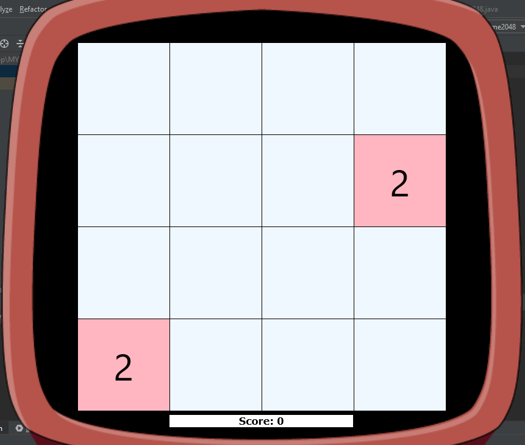
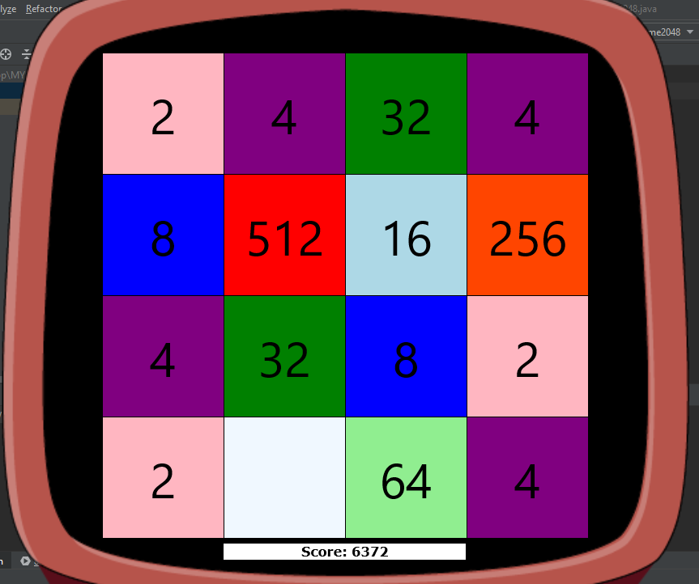
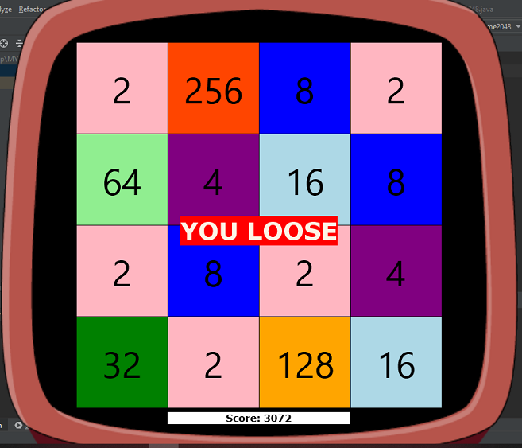
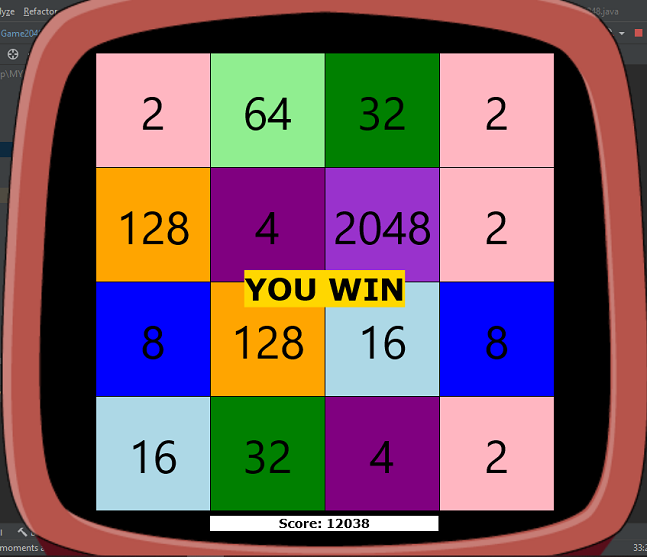

# 2048

## Table of contents
* [General info](#general-info)
* [Technologies](#technologies)
* [Setup](#setup)
* [View](#view)

## General info
The Game - 2048 is an application written in Java.  
The objective of the game is to slide numbered tiles on a grid to combine them to create a tile with the number 2048.
* To move tiles on desired side use the buttons of "UP", "DOWN", "LEFT", "RIGHT".
* To start a new game click the 'space' button on your keyboard.
	
## Technologies
Project created with:
* Java: 1.8
* lib: desktop-game-engine.jar
	
## Setup
To run this project, create the JavaFX application and copy the source code.  
Download the desktop-game-engine.jar.  
Then add the downloaded .jar file to your IDE in the library section.

## View
After starting the application, the game will start.  
You will see the gaming board with two default numbers 2 or 4  
(numbers created with a different chance - 10% for 4 and 90% for 2)    

During the game, the player will earn points for each successful tiles merge.  
  

If there are no free moves left (there is no way to connect the cells)  
Then the game is ended, and the player receives messages that he lost the game
  

To win the game player should collect the tile with the number 2048.
  
